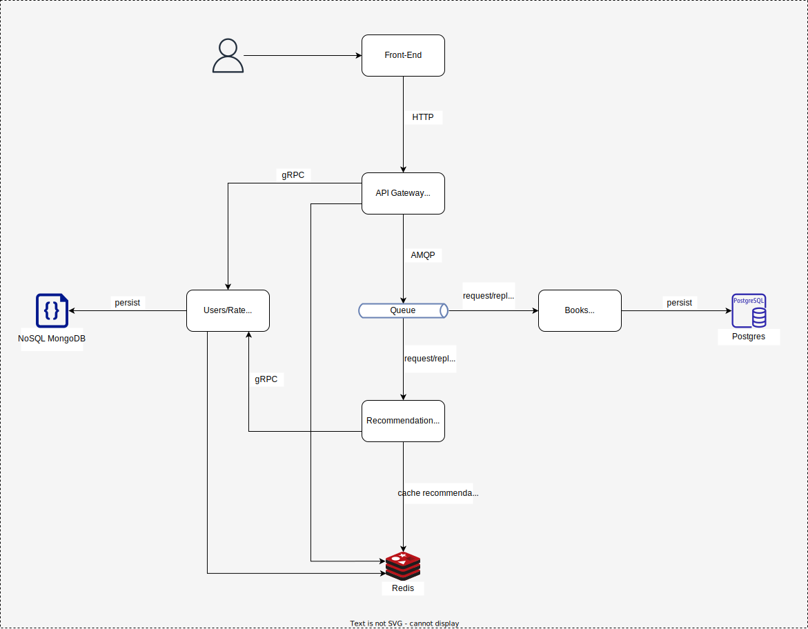
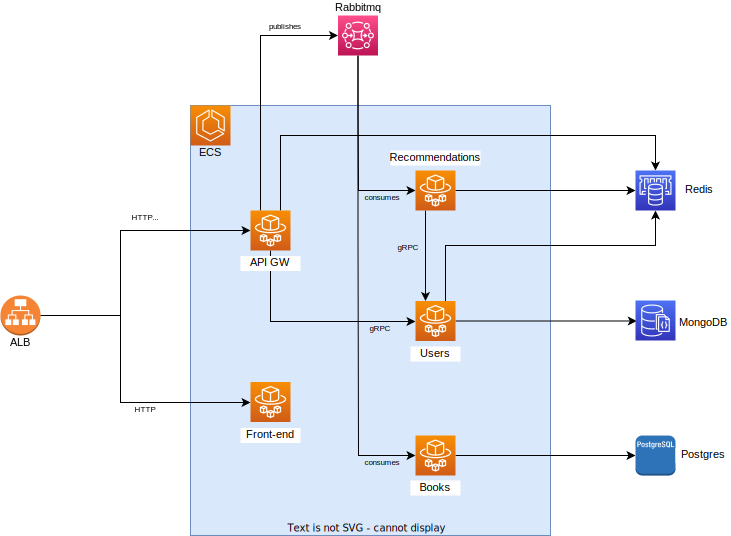

# Book Recommendations

This project is a mesh of microservices simulating a complex environment with different kinds of protocols to expose/interconnect services, like gRPC and AMQP.

Also it implements an API Gateway to proxy and orquestrate requests through internal services, in addition it makes the authentication for the requests.

The services which use AMQP queue to receive commands, use the request/response pattern.

The main intention it is to calculate and recommend books based on users ratings.

## Application architecture


## Up and Running

It is possible to run all services locally using docker and docker-compose.

### Locally

```bash
# network
docker network create \
  --driver=bridge \
  -o "com.docker.network.bridge.name"="br-msbook" \
  -o "com.docker.network.bridge.host_binding_ipv4"="0.0.0.0" \
  --subnet=172.100.10.0/24 \
  --gateway=172.100.10.1 msbook
docker network inspect msbook --format="{{json .IPAM.Config}}"
# [{"Subnet":"172.100.10.0/24","Gateway":"172.100.10.1"}]

# infrastructure
docker-compose -f docker-compose-infra.yaml up -d --build
docker-compose -f docker-compose-infra.yaml logs -f --tail 50

# services
docker-compose -f docker-compose-services.yaml up -d --build
docker-compose -f docker-compose-services.yaml logs -f --tail 50
```

### Cloud

The services are going to run on AWS, using ECS with Fargate for containers underlying infrastructure.

Also it will use services like RDS Postgres, DocumentDB, Amazon MQ for Rabbitmq, ElasticCache for Redis, for databases, event broker and cache respectively.

## Cloud architecture


Instructions for deploy here: [Instructions](./infrastructure/README.md)

## CI/CD flow architecture

