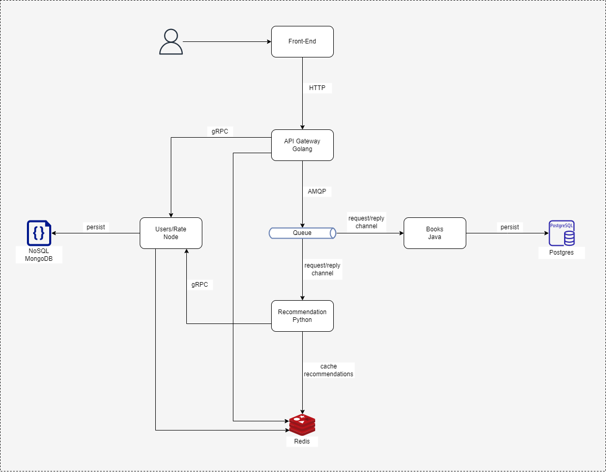
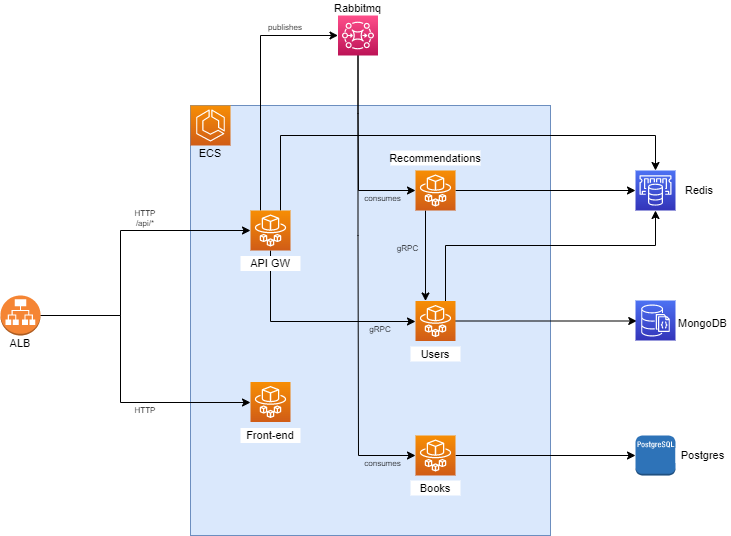

# Book Recommendations

This project is a mesh of microservices simulating a complex environment with different kinds of protocols to expose/interconnect services, like gRPC and AMQP.

Also it implements an API Gateway to proxy and orquestrate requests through internal services.

The main intention it is to calculate and recommend books based on users ratings.

## Application architecture


## Up and Running

It is possible to run all services locally using docker and docker-compose.

### Locally

```bash
# infrastructure
docker-compose up -d --build postgres mongo redis rabbitmq

# services
docker-compose up -d --build \
  api-gateway \
  users-microservice \
  books-microservice \
  recommendations-microservice \
  client-microservice
```

### Cloud

The services are going to run on AWS, using ECS with Fargate for containers underlying infrastructure.

Also it will use services like DocumentDB, Amazon MQ, ElasticCache for Redis and RDS Postgres, for databases, event queues and cache.

## Cloud architecture


## Unit Tests

- [x] users-microservice
- [x] books-microservice
- [ ] recommendations-microservice
